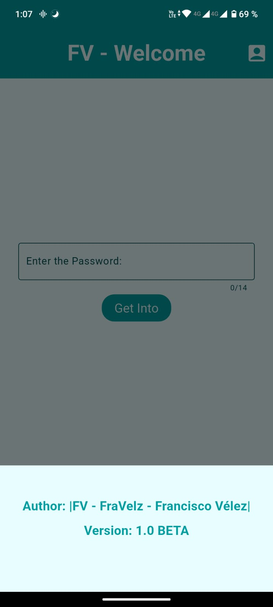
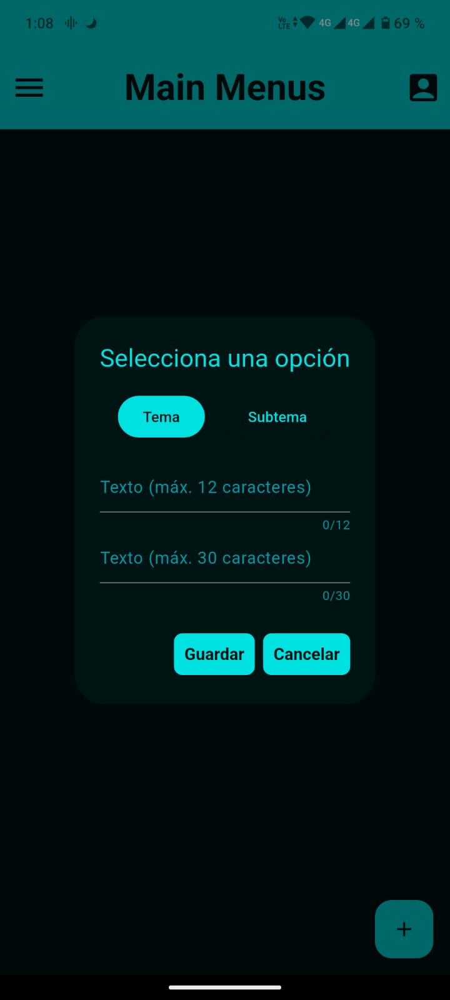
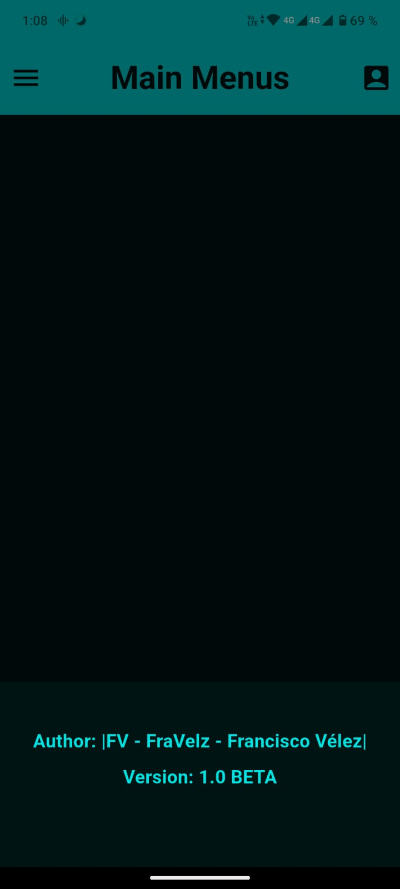
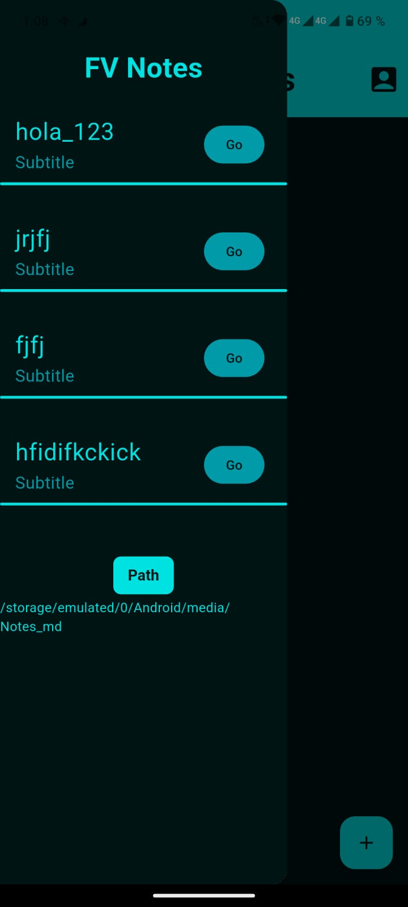

# App_Flutter - Personal_Notes

Project #3 with Flutter. The idea of ​​this project is to create a 
notepad on the mobile.

## Code structure

Application name: FV Notes

Name configured in the file:
```
android/app/src/main/AndroidManifest.xml
```

Code:
```xml
<application
android:name=".MainActivity"
android:label="FV Notes"
... >
```

## Images UI Interface
1. Main.dart (Estructure, base, and Login):

You can write any text as a password, if you write the following text it will 
not let you pass: password123 


Author's name.




2. Page #2 (layer_one/menu.dart, ...):

Home Page:


Create notes.



Author's name.



bar to view the created notes.



3. Logo APP


> Note: Keep in mind that the visual part of the project is already complete, 
> and many of the program's functions still need to be completed and improved.

> Author: Fravelz